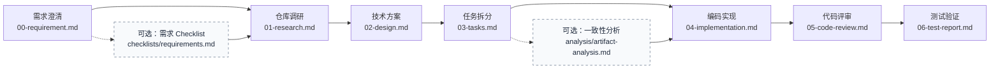
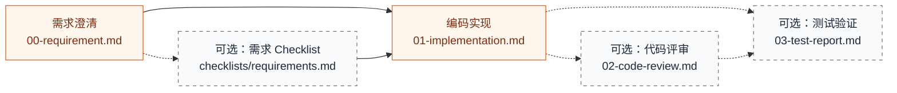

# ZSTT Backend Workflow

[](https://github.com/Foutlook/zstt-backend-workflow/actions/workflows/ci.yml)

面向团队的 Codex Java 后端开发工作流套件。这个仓库不只提供一组提示词，而是把项目级 Skills（技能）、动态 Rules（规则）、确定性 Runtime（运行时）、产物 Templates（模板）和安全安装 CLI 组合成一套可提交、可恢复、可校验的工程工作流。

首版支持 Codex 与 Java 后端项目。流程覆盖需求澄清、仓库调研、技术方案、任务拆分、编码实现、代码评审和测试验证，并提供 Quick/Full 两种处理强度、两个可选质量门禁以及现有功能分析、Bug 排查、代码简化、模块重构等独立能力。

**快速导航：** [5 分钟开始使用](#5-分钟开始使用) · [Full 与 Quick](#full-与-quick) · [13 个 Skill](#13-个-skill) · [产物与契约](#产物与契约) · [运行时与门禁](#运行时与门禁) · [安装和升级](#安装和升级) · [命令参考](#命令参考)

## 仓库提供什么

| 能力层 | 解决的问题 | 安装到业务仓库的位置 |
| --- | --- | --- |
| `zstt-cli` | 初始化、升级、完整性检查、Git/Codex 发现诊断 | 全局命令 `zstt` |
| 13 个项目级 Skill | 告诉 Codex 当前阶段或辅助任务该如何执行 | `.agents/skills/zstt-*/` |
| 动态 Rules | 按 Skill 和真实代码上下文加载工作流、Java、数据访问、并发等约束 | `.zstt-kit/rules/` |
| Workflow Runtime | 管理需求状态、分支绑定、阶段顺序、内容校验、指纹失效和稳定错误码 | `.zstt-kit/runtime/` |
| Full/Quick Templates | 为每个阶段和可选质量门禁提供固定结构 | `.zstt-kit/templates/` |
| 环境隔离与集成约定 | 隔离测试/生产、后端/客户端、DMS/ES/Observability 凭据范围 | `.zstt-kit/.env/`、`runtime/with_env.py` |
| 验证与发布流水线 | 校验 Skill 契约、测试、UTF-8、Python、Wheel 内容和真实安装 | `scripts/`、`tests/`、GitHub Actions |

## 核心原则

- 行动前对齐目标，契约优先于实现；需求、代码事实、设计决策和实现任务必须可追溯。
- 用户显式调用当前 Skill。系统可以推荐下一步，但不会自动执行任何推荐的 Skill。
- 每次只完成当前阶段，并在 `.zstt/` 保留一份唯一权威主产物。
- 文档已生成不等于阶段完成；只有实质内容门禁通过、P0 清零并记录输入指纹后才能继续。
- 需求 Checklist 和实现前一致性分析可以跳过；一旦执行就持久化，后续上下文会消费报告，不能只把问题留在对话里。
- 下游采用增量写作：引用 `Rxx/Cxx/Dxx/Txx`，只记录本阶段新增事实、决策和偏差，不复制上游正文。
- 实现阶段由 Runtime 自动保存 Git 基线、相对基线的文件变化和验证命令结果；既存用户改动不会仅因出现在最终 diff 中就自动归因于本轮实现。
- 用户修改已完成产物后，Runtime 会重新校验并使该阶段及下游旧结论失效。
- 工具不可用时允许标准降级，但不能伪造远程证据、运行结果或测试通过。
- 固定流程止于测试验证，不自动 commit、push、合并、发布或部署。

## 5 分钟开始使用

### 1. 管理员安装并初始化

环境要求 Python 3.11+，推荐使用 `uv`：

```powershell
uv tool install zstt-cli --force --from "git+https://github.com/Foutlook/zstt-backend-workflow.git"
cd C:\projects\learning-service
zstt init --here
zstt doctor --here
```

确认生成内容后，将 `.agents/skills/zstt-*` 和 `.zstt-kit/` 提交到业务仓库。`.agents/skills` 必须位于实际业务 Git 仓库内，不能只安装在包含多个子仓库的聚合目录。

### 2. 团队成员拉取后新建 Codex 任务

普通成员不需要重复安装 CLI。拉取管理员提交的文件，在业务仓库根目录新建 Codex 任务，然后显式调用第一个 Skill：

```text
$zstt-requirement-clarification
请按 full 模式澄清这份需求：<PRD、截图、流程图、表格或口头说明>
```

小范围、低风险改动也可以选择 Quick：

```text
$zstt-requirement-clarification
请按 quick 模式澄清这个小改动：<问题描述与验收标准>
```

未指定模式时，Skill 会给出 Quick/Full 推荐和依据；最终模式仍由用户选择，或由用户明确授权 AI 采用推荐。

### 3. 审阅产物，再显式继续

需求澄清会创建需求目录、`meta.json` 和 `00-requirement.md`。审阅并确认当前产物后，可以执行可选检查，也可以直接进入固定下一阶段：

```text
$zstt-requirement-checklist
检查 .zstt/features/20260729-learning-report

# 或跳过可选检查
$zstt-repo-research
继续处理 .zstt/features/20260729-learning-report
```

每个阶段完成后都遵循同一节奏：**审阅当前产物 → 需要时修正 → 显式调用下一 Skill**。关闭 Codex 任务不会丢失进度；后续新任务通过 `.zstt/` 产物、`meta.json` 和输入指纹恢复。

## Full 与 Quick

| 模式 | 适用场景 | 固定主产物 | 阶段要求 |
| --- | --- | --- | --- |
| **Full** | 正式需求、跨模块改动、接口/消息/数据结构变化、SQL 变化、高风险业务逻辑 | 7 份 | 需求、调研、方案、任务、实现、评审、测试依次完成 |
| **Quick** | 范围明确、影响面小、风险较低且不需要独立方案评审的小改动 | 最多 4 份 | 需求和实现必需；评审、测试按需调用 |

### Full 固定链路



| 阶段 | 主要回答 | 固定 Skill |
| --- | --- | --- |
| 需求澄清 | 要做什么、边界和验收是什么，原始材料是否全部收口 | `$zstt-requirement-clarification` |
| 仓库调研 | 真实入口、调用链、数据源、关键参数、仓库范围和副作用是什么 | `$zstt-repo-research` |
| 技术方案 | 怎么改、为什么、契约和 SQL 如何处理、怎样发布和回滚 | `$zstt-technical-design` |
| 任务拆分 | 改哪些文件、依赖顺序、完成标准和验证信号是什么 | `$zstt-task-breakdown` |
| 编码实现 | 实际改了什么、是否偏离方案、验证结果如何 | `$zstt-implementation` |
| 代码评审 | 实现是否正确、安全、可维护且与上游一致 | `$zstt-code-review` |
| 测试验证 | 需求是否闭环、差异来自哪里、能否交付 | `$zstt-test-verify` |

### Quick 轻量链路



Quick 的固定链路仍是“需求澄清 → 实现”。Quick 需求只写会改变实现或验收的最小契约，无关维度直接省略，并持久化模式评估、用户决定和决定来源；决定升级 Full 时保持 Quick 为 draft。实现记录引用需求 ID，不再复述整份需求。需求 Checklist 不会被自动推荐或插入链路，但用户显式执行后，已有报告会在实现前校验。实现完成后，Runtime 同时推荐可选 Review 和测试；测试完成后流程结束，不会倒退推荐 Review。即使跳过 Review，测试报告仍固定为 `03-test-report.md`。

## 13 个 Skill

所有 Skill 都由用户显式调用。固定阶段会推进 Full/Quick 状态；质量门禁与其他辅助 Skill 不进入固定阶段。

| Skill | 类型与模式 | 何时使用 | 主要产物 | 对阶段状态的影响 |
| --- | --- | --- | --- | --- |
| `$zstt-requirement-clarification` | 固定阶段；Full/Quick | 材料尚未形成明确范围、业务口径和验收标准时 | Full/Quick `00-requirement.md` | 完成需求阶段 |
| `$zstt-requirement-checklist` | 可选质量门禁；Full/Quick | 调研或 Quick 实现前检查需求完整性、清晰度、一致性、可度量性和可追溯性 | `checklists/requirements.md` | 不推进；存在即被下游消费 |
| `$zstt-repo-research` | 固定阶段；仅 Full | 需要用真实源码、查询、RPC/MQ 和配置定位执行链与数据源时 | `01-research.md` | 完成调研阶段 |
| `$zstt-technical-design` | 固定阶段；仅 Full | 代码事实已查清，需要形成可评审的最小技术方案时 | `02-design.md`；按需生成 `auxiliary/sql-design.sql` | 完成方案阶段 |
| `$zstt-task-breakdown` | 固定阶段；仅 Full | 需要把设计拆成可执行、可追溯、可验证的编码任务时 | `03-tasks.md` | 完成任务阶段 |
| `$zstt-artifact-analysis` | 可选质量门禁；仅 Full | 任务完成、编码前，横向检查 `Rxx → Cxx → Dxx → Txx` 和契约/数据/依赖一致性 | `analysis/artifact-analysis.md` | 不推进；存在即被实现消费 |
| `$zstt-implementation` | 固定阶段；Full/Quick | 上游已就绪，需要按任务或 Quick 边界实施最小代码改动时 | Full `04-implementation.md`；Quick `01-implementation.md`；自动证据 `auxiliary/implementation-evidence.json` | 完成实现阶段 |
| `$zstt-code-review` | Full 固定；Quick 可选 | 实现后核对上游契约、真实 diff、正确性、安全性和可维护性 | Full `05-code-review.md`；Quick `02-code-review.md` | Full 必需；Quick 按需记录 |
| `$zstt-test-verify` | Full 固定；Quick 可选 | 执行测试并区分需求、方案、实现、用例、环境/数据和覆盖差异时 | Full `06-test-report.md`；Quick `03-test-report.md` | Full 必需；Quick 按需记录 |
| `$zstt-product-feature-analysis` | 只读辅助 | 需要面向产品、测试或开发解释已有功能、业务规则、接口、调用链和数据来源时 | 默认在当前任务交付；显式要求时写 `.zstt/analyses/features/` | 不推进固定阶段 |
| `$zstt-bug-fix` | 按需辅助 | Bug、线上/偶现问题、日志/Trace/DMS MySQL/ES 数据异常排查 | 默认在当前任务交付；显式要求时写 `.zstt/bugs/` 或 `auxiliary/bugs/` | 不推进固定阶段 |
| `$zstt-code-simplification` | 按需辅助 | 当前 diff、提交、文件或符号功能正确，但可在行为不变前提下简化 | 代码 diff；关联需求时可写 `auxiliary/` | 不推进固定阶段 |
| `$zstt-module-refactor` | 审批型辅助 | 多文件职责拆分、模块/DDD 边界调整，或有证据的性能、并发、资源治理 | `.zstt/refactors/` 或 `auxiliary/refactors/` | 不推进；重大或行为变化方案先审批 |

### 选择入口

- 新需求或需求口径不清：从 `$zstt-requirement-clarification` 开始。
- 只想说明一个已有功能当前怎样工作：使用 `$zstt-product-feature-analysis`；新需求转需求澄清，疑似契约违反转 Bug Fix。
- 上一步已完成，想在行动前再次对齐契约：需求后用 `$zstt-requirement-checklist`，Full 任务后用 `$zstt-artifact-analysis`。
- 已知是故障或数据异常：先用 `$zstt-bug-fix` 确认支持缺陷、支持非缺陷或有界未解决；只有支持缺陷才继续根因和最小修复，涉及新增能力、契约、SQL、核心状态或权限变化时再进入 Full/Quick。
- 已有明确任务并准备改代码：用 `$zstt-implementation`；实现后的静态评审与实际验证分别用 `$zstt-code-review`、`$zstt-test-verify`。
- 只做行为保持型整理：用 `$zstt-code-simplification`；涉及多文件职责或架构边界时用 `$zstt-module-refactor`。

## 产物与契约

### Full 产物

```text
.zstt/features/YYYYMMDD-feature-name/
├─ meta.json
├─ 00-requirement.md
├─ checklists/
│  └─ requirements.md          # 可选需求质量门禁
├─ 01-research.md
├─ 02-design.md
├─ 03-tasks.md
├─ analysis/
│  └─ artifact-analysis.md     # 可选实现前一致性门禁
├─ 04-implementation.md
├─ 05-code-review.md
├─ 06-test-report.md
└─ auxiliary/
   └─ implementation-evidence.json  # Runtime 自动维护的 Git/验证证据
```

### Quick 产物

```text
.zstt/quick/YYYYMMDD-quick-name/
├─ meta.json
├─ 00-requirement.md
├─ checklists/
│  └─ requirements.md          # 仅显式调用时创建
├─ 01-implementation.md
├─ 02-code-review.md           # 可选
├─ 03-test-report.md           # 可选，编号固定
└─ auxiliary/
   └─ implementation-evidence.json  # Runtime 自动维护的 Git/验证证据
```

每个阶段只创建自己的产物，不提前生成后续空文档。不同文件的权威边界如下：

| 产物类型 | 作用 | 能否替代上游结论 |
| --- | --- | --- |
| `00`–`06` 主产物 | 当前阶段唯一权威结论 | 是该阶段的权威来源 |
| `meta.json` | Runtime 管理的模式、分支、阶段、指纹、推荐和关闭状态 | 否；不要手工编辑 |
| `checklists/requirements.md` | 针对当前需求版本的派生质量报告 | 否；问题应回写 `00-requirement.md` |
| `analysis/artifact-analysis.md` | 针对需求、调研、方案、任务当前版本的一致性报告 | 否；问题应回写对应权威产物 |
| `auxiliary/` | 接口明细、Schema、SQL 草案、实现证据、Review/Test 轮次等细节 | 否；必须被主产物索引或由 Runtime 自动关联 |
| `.zstt/bugs/`、`.zstt/refactors/` | 不隶属某个需求的独立 Bug/重构记录 | 不改变 Full/Quick 状态 |

需求材料要点、正式需求和疑问分别使用 `Sxx`、`Rxx`、`Qxx`；调研结论、证据和代码事实问题使用 `Cxx`、`Exx`、`RQxx`；设计与任务使用 `Dxx`、`Txx`。Runtime 校验这些 ID 的唯一性、引用、来源、验收和覆盖关系，避免“文档很多但无法追到实现”。

### 两个可选质量门禁的纠正闭环

质量报告不是聊天摘要，而是带输入 SHA-256 指纹的持久化派生产物：

1. Skill 读取当前权威产物并创建报告；
2. `passed` 表示无未解决项，`conditional` 表示只有 P1/P2 风险，`blocked` 表示存在 P0 或报告无效；
3. 发现问题时，返回对应阶段更新权威主产物，而不是只改报告或把结论留在对话中；
4. 上游一旦改变，旧报告自动成为 `stale`（过期）；
5. 重新运行质量 Skill，基于新输入生成或更新报告，再进入下游。

报告不存在等于显式跳过，原链路不受影响；报告一旦存在，下游采用“存在即消费”。P0、无效或过期报告会阻断；只有 P1/P2 时记录风险后允许继续。

## 运行时与门禁

Runtime 负责确定性状态和校验，Skill 负责分析与写作，两者分工如下：

| 门禁 | 触发点 | 行为 |
| --- | --- | --- |
| 阶段顺序 | `prepare-stage`、`complete-stage` | Full 不可跳过固定阶段；Quick 保持固定编号和可选分支 |
| 实质内容 | 完成阶段时 | 校验状态、必需章节、模板占位、P0、追溯 ID 和阶段专属矩阵 |
| 输入指纹 | 准备下游、查看状态时 | 用户修改已完成产物后，撤销该阶段及下游旧完成状态，但保留文件 |
| 需求 Checklist | Full 调研前；Quick 实现前 | 缺失则跳过；已有报告必须有效、新鲜且无 P0 |
| 产物一致性分析 | Full 实现前 | 校验四份上游产物、规则快照、覆盖、状态和输入指纹 |
| 实现证据 | 准备/完成实现、进入 Review 或测试前 | 自动记录 Git 基线、相对变化和验证结果；至少一条成功验证必须匹配最终工作区快照，且同一快照不能仍有失败验证 |
| SQL Gate | Full 技术方案内 | `none` 记录无影响；`query_dml`/`ddl` 必须提供精确 SQL 并由用户确认 |
| 当前需求解析 | `current`、`--current` | 只按当前 Git 分支选择唯一活动需求，不按日期或最近修改时间猜测 |
| 关闭与恢复 | 自动完成或 `close` | Full 完成测试、Quick 完成测试时自动关闭；已关闭产物变化后可重新恢复 |

技术方案的 SQL Gate 分两步：先用 `prepare-sql-gate` 记录 `none/query_dml/ddl`；涉及 SQL 时在 `auxiliary/sql-design.sql` 给出精确语句，再由用户明确确认并运行 `confirm-sql` 锁定指纹。确认前不能完成技术方案或进入任务拆分；确认后的 SQL 再变化会使门禁过期。

`meta.json` v3 使用 `.zstt/...` 相对路径，避免提交某个成员的本机绝对路径。旧 v2 状态可以读取，并在下一次成功写入时迁移；没有分支信息的历史需求需要显式 `bind-branch`。

## Skill、Rules、Runtime 和 Templates

初始化后的业务仓库结构：

```text
.agents/
└─ skills/
   └─ zstt-*/                  # 13 个用户可调用 Skill
.zstt-kit/
├─ manifest.json               # CLI 版本与受管文件 SHA-256
├─ project-databases.json      # 用户维护的项目/数据库与日志映射，不受 update 覆盖
├─ rules/
│  ├─ catalog.json
│  ├─ workflow/
│  └─ java/
├─ runtime/
│  ├─ workflow_cli.py
│  ├─ workflow_contracts.py
│  ├─ workflow_validation.py
│  ├─ quality_gates.py
│  ├─ rule_resolver.py
│  ├─ with_env.py
│  ├─ sls_client.py
│  └─ dms_mcp_client.py
├─ templates/
│  ├─ full/
│  ├─ quick/
│  └─ quality-gates/
└─ .env/
   ├─ .env.example
   ├─ .env.prod.example
   └─ .gitignore
```

- **Skill（技能）**：用户显式选择的当前执行流程。
- **Rules（规则）**：不作为 Skill 暴露，由当前 Skill 动态读取。
- **Runtime（运行时）**：维护状态、路径、契约、指纹和确定性门禁。
- **Templates（模板）**：定义主产物和质量报告结构。

Rules 分为 `constraint`（硬约束）、`decision`（证据满足时采用的决策）、`checklist`（检查表）和 `reference`（按需参考）。每个 Skill 先加载固定 profile（规则画像），再根据已经读过的真实代码、调用链和数据源追加上下文，例如 `jackson`、`data-access`、`concurrency`、`transaction`、`ddd`。不能只凭文件名或关键词推断上下文。

规则解析结果包含规则集版本、规则 ID、选择原因、各文件 SHA-256 和整体 `rulesetFingerprint`。工作范围扩大后重新解析，确保新上下文加载正确规则。

## 高级能力与外部集成

每个阶段先做能力探测，并明确记录：

- **增强路径**：远程仓库、CodeGraph、PDF/图像解析、运行环境或测试通道可用时，使用对应能力；
- **标准降级**：工具不可用时回到本地源码、`rg`、静态证据或局部验证，同时记录证据置信度和未验证边界；
- **阻塞**：缺少权限、环境、前置数据或关键证据会影响结论时，不输出伪完成或伪通过。

仓库调研采用显式本地路径优先。用户给出 checkout 后，只读取这些路径，不探测或切换远程来源；未给路径时，才检查本机受 Git 忽略的私有配置和当前会话是否真实暴露匹配的只读仓库 MCP。`.env.local` 不会自动注册 MCP，其中的 URL 也不是可直接请求的普通 HTTP 接口。

现有功能分析不要求先创建需求目录。它把产品意图、当前实现、一次运行观察、持久状态和分析推断分开，只回答当前规则、流程和数据来源；只有用户明确要求时才扩展变更影响。新需求转入需求澄清，疑似契约违反转入 Bug Fix，不在功能说明中越界设计或修复。

Bug 排查可以结合代码、Trace、SLS 日志、DMS MCP 中的 MySQL 数据、ES 和时间线。问题排查先形成确认卡，再判断支持缺陷、支持非缺陷或有界未解决；只有支持缺陷才继续责任、根因和最小修复。SLS 日志默认通过对应环境与端的 Observability Scope 注入凭据，并调用 `.zstt-kit/runtime/sls_client.py` 直接查询；不先探测 Observability MCP。Trace MCP 只在日志证据需要补充 Span 拓扑时使用；凭证直查具体不可用时，已注册且环境匹配的只读 SLS MCP 才可作为程序化降级。DMS MCP 未注册时，可以通过 `.zstt-kit/runtime/dms_mcp_client.py` 启动固定版本的官方 Server，并在调用前校验目标环境、实例和只读 SQL。能力不可用时输出精确查询条件，等待用户回传脱敏结果。开发角色只有在用户看到完整结论并二次确认后才执行最小修复。ZSTT 不打包 MCP Server 二进制、数据库连接信息或凭据。

高级能力的来源、融合位置、边界和验证索引见 [高级能力融合矩阵](docs/advanced-capability-matrix.md)。

### 本机环境与凭据隔离

首次初始化会创建示例文件和空的 `project-databases.json`：

```powershell
Copy-Item .zstt-kit\.env\.env.example .zstt-kit\.env\.env.local
Copy-Item .zstt-kit\.env\.env.prod.example .zstt-kit\.env\.env.prod.local
```

真实 `*.local` 文件受 Git 忽略，不进入安装清单，`zstt update` 不读取或覆盖。生产配置缺失时禁止回退到测试环境。需要让本地只读工具临时使用凭据时，通过范围启动器执行：

```text
python .zstt-kit/runtime/with_env.py <test|prod> <observability|observability-client|dms|es> -- <command> [args...]
```

| Scope | 只注入 |
| --- | --- |
| `observability` | 当前环境的后端 `ALIBABA_CLOUD_*` |
| `observability-client` | 当前环境的客户端 AK，并临时映射为标准 `ALIBABA_CLOUD_*` |
| `dms` | 当前环境独立的 `ZSTT_DMS_ALIBABA_CLOUD_*`，并临时映射为标准 `ALIBABA_CLOUD_*` |
| `es` | `ZSTT_ES_*` |

启动器会先清除其他 ZSTT 受管凭据，再向子进程注入当前环境与当前 Scope 所需变量，避免后端/客户端、测试/生产或 DMS/ES 凭据串用。测试与生产 DMS 分别读取 `.env.local` 和 `.env.prod.local`，任一环境缺失时都不会回退到另一环境。

SLS 日志使用 `project-databases.json` 中已确认的映射直接查询，示例结构如下；时间使用 Unix 秒，客户端限制单次最多 100 条、时间范围最多 7 天：

```text
python .zstt-kit/runtime/with_env.py <test|prod> <observability|observability-client> -- python .zstt-kit/runtime/sls_client.py --region <region> --project <project> --logstore <logstore> --from-time <unix-seconds> --to-time <unix-seconds> --query <收敛查询> --line <1-100>
```

## 安装和升级

### 安装方式

ZSTT 使用项目初始化方式，不依赖 Codex 插件或 Marketplace。默认从 GitHub `main` 安装最新版本：

```powershell
uv tool install zstt-cli --force --from "git+https://github.com/Foutlook/zstt-backend-workflow.git"
zstt version
```

私有仓库使用团队已有的 HTTPS 凭证或 SSH Key，不要把 token 写进命令、脚本或 README。

### 初始化边界

```powershell
cd C:\projects\learning-service
zstt init --here
zstt doctor --here
```

`zstt doctor` 检查安装清单、13 个 Skill、Git 根目录、父级错误安装、嵌套仓库和 Codex 发现边界。若聚合目录下有多个独立 Git 仓库，应分别进入每个真实仓库初始化。

CLI 只管理清单记录的以下内容：

- `.agents/skills/zstt-*/`
- `.zstt-kit/rules/`
- `.zstt-kit/runtime/`
- `.zstt-kit/templates/`
- `.zstt-kit/.env/` 中的示例文件与 `.gitignore`

它不会接管 `AGENTS.md`、其他项目级 Skill、业务源码、`.zstt/` 业务产物、本机 `.env*.local` 或用户维护的 `project-databases.json`。

### 升级

先升级全局 CLI，再刷新每个业务仓库：

```powershell
uv tool install zstt-cli --force --from "git+https://github.com/Foutlook/zstt-backend-workflow.git"
cd C:\projects\learning-service
zstt doctor --here
zstt check --here
zstt update --here
zstt doctor --here
```

如果受管文件被人工修改，`zstt update` 会在写入前一次性报告全部冲突并停止。人工合并后重试；只有明确接受覆盖时才使用 `zstt update --here --force`。`--force` 仍受清单和受管根目录限制，不会扩张到业务文件或用户配置。

`init/update` 使用项目级安装锁和整批事务：暂存并校验全部候选文件，备份旧文件，提交受管内容，最后更新清单。中途失败会自动恢复；若回滚本身失败，返回 `ZSTT_INSTALL_ROLLBACK_FAILED` 并保留错误详情中的事务目录供人工恢复。

从 0.1.x 升级时，manifest v1 会兼容迁移到 v2。未修改的旧内部 Skill 会被清理；存在本地修改时升级停止并报告冲突。升级后评审 Git diff、提交生成文件，并新建 Codex 任务加载新版 Skill。

## 命令参考

### `zstt` CLI

所有项目命令都支持位置路径或 `--here`；`--here` 不能与路径同时使用。

| 命令 | 用途 | 常用选项 |
| --- | --- | --- |
| `zstt version` | 显示 CLI 版本 | — |
| `zstt init [path]` | 首次安装项目级工作流 | `--here`、`--force`、`--json` |
| `zstt update [path]` | 按当前 CLI 刷新受管文件 | `--here`、`--force`、`--json` |
| `zstt check [path]` | 检查版本、缺失和本地修改 | `--here`、`--json` |
| `zstt doctor [path]` | 诊断 Git 根、嵌套仓库、Skill 数量和 Codex 可发现性 | `--here`、`--json` |

机器调用示例：

```powershell
zstt init --here --json
zstt update --here --json
zstt check --here --json
zstt doctor --here --json
```

失败返回非零退出码。人类可读错误带稳定的 `[ZSTT_...]` 前缀；JSON 错误包含 `status`、`operation`、`error.code`、`error.message` 和 `error.details`。

### Workflow Runtime

正常使用时由 Skill 调用 Runtime；维护、调试或自动化时可以直接运行：

| 命令 | 用途 |
| --- | --- |
| `workflow_cli.py init` | 初始化 Full/Quick 需求目录、首份模板和 `meta.json` |
| `workflow_cli.py list` | 只读列出仓库内有效需求 |
| `workflow_cli.py current` | 按当前 Git 分支解析唯一活动需求 |
| `workflow_cli.py status` | 输出阶段、推荐、指纹、SQL 与质量门禁状态 |
| `workflow_cli.py bind-branch` | 将没有分支信息的历史需求绑定到当前分支 |
| `workflow_cli.py close` | 完成必需阶段后显式关闭，主要用于跳过 Quick 可选阶段 |
| `workflow_cli.py validate` | 只校验指定阶段产物 |
| `workflow_cli.py prepare-stage` | 重新校验上游并创建目标阶段模板 |
| `workflow_cli.py complete-stage` | 校验当前产物并记录完成状态与指纹 |
| `workflow_cli.py run-validation` | 执行实现验证命令，记录脱敏后的命令、退出码和耗时 |
| `workflow_cli.py prepare-quality-gate` | 创建需求 Checklist 或产物分析模板及输入指纹 |
| `workflow_cli.py validate-quality-gate` | 校验质量报告结构、计数、状态和输入新鲜度 |
| `workflow_cli.py prepare-sql-gate` | 记录 `none/query_dml/ddl` SQL 影响 |
| `workflow_cli.py confirm-sql` | 用户确认后锁定当前 SQL 指纹 |

常用示例：

```text
python .zstt-kit/runtime/workflow_cli.py init --repo-root <repo> --mode full --feature-name <name>
python .zstt-kit/runtime/workflow_cli.py list --repo-root <repo>
python .zstt-kit/runtime/workflow_cli.py current --repo-root <repo>
python .zstt-kit/runtime/workflow_cli.py status --current --repo-root <repo>
python .zstt-kit/runtime/workflow_cli.py prepare-stage --feature-dir <feature-dir> --stage repo_research
python .zstt-kit/runtime/workflow_cli.py complete-stage --feature-dir <feature-dir> --stage requirement_clarification
python .zstt-kit/runtime/workflow_cli.py run-validation --feature-dir <feature-dir> -- mvn test
python .zstt-kit/runtime/workflow_cli.py prepare-quality-gate --feature-dir <feature-dir> --gate requirement_checklist
python .zstt-kit/runtime/workflow_cli.py validate-quality-gate --feature-dir <feature-dir> --gate requirement_checklist
python .zstt-kit/runtime/workflow_cli.py prepare-sql-gate --feature-dir <feature-dir> --impact query_dml
python .zstt-kit/runtime/workflow_cli.py confirm-sql --feature-dir <feature-dir> --source <用户确认来源>
```

Runtime 的 `--json` 是全局选项，必须放在子命令前：

```text
python .zstt-kit/runtime/workflow_cli.py --json status --feature-dir <feature-dir>
```

显式 `--feature-dir` 的优先级高于 `--current`。`current` 遇到 0 个、多个、损坏或未绑定分支的候选时会返回稳定错误码，不使用“最近修改”兜底。

### Rule Resolver

```text
python .zstt-kit/runtime/rule_resolver.py check
python .zstt-kit/runtime/rule_resolver.py list-contexts
python .zstt-kit/runtime/rule_resolver.py resolve --skill zstt-implementation --context jackson --context data-access
```

`check` 校验 catalog、规则路径、UTF-8 和 profile；`resolve` 输出实际选中的规则、选择原因和确定性指纹。

## 错误恢复

| 现象 | 处理方式 |
| --- | --- |
| Codex 找不到 `$zstt-*` | 在当前业务 Git 仓库运行 `zstt doctor --here`；修复仓库边界后重新初始化并新建 Codex 任务 |
| `current` 找不到或匹配多个需求 | 用 `list` 查看候选；显式传 `--feature-dir`，或关闭/绑定不正确的需求 |
| 历史需求没有分支 | 确认目标后运行 `bind-branch`，不要按时间猜测 |
| 缺少上游文件 | 回到对应 Skill 补齐，不手工创建后续空文档 |
| 用户修改已完成产物 | 核对影响并重新完成被修改阶段；Runtime 会重新校验并撤销下游旧状态 |
| Checklist/分析报告为 `stale` | 先确认上游修正，再重新执行对应质量 Skill |
| SQL 确认后又修改草案 | 重新执行 `prepare-sql-gate` 并请求用户再次确认 |
| 内容门禁失败 | 按错误补齐实质章节、ID、引用、来源、验收或矩阵；不要只改 `status` 和计数字段 |
| Quick 影响面扩大 | 重新执行需求澄清并由用户确认升级 Full，不自动改模式 |
| 安装冲突 | 人工评审全部冲突；确认覆盖受管文件时才使用 `--force` |
| `ZSTT_INSTALL_LOCKED` | 确认没有其他安装进程；不要直接删除仍被活动进程持有的锁 |
| `ZSTT_INSTALL_ROLLBACK_FAILED` | 保留错误中给出的事务目录，按备份和 journal 人工恢复 |
| 生产环境配置缺失 | 补齐 `.env.prod.local` 或停止；不得回退测试凭据 |

## 维护者开发与验证

在本仓库安装当前工作区版本：

```powershell
uv tool install zstt-cli --force .
zstt version
```

完整验证：

```powershell
powershell.exe -NoProfile -ExecutionPolicy Bypass -File .\scripts\validate.ps1
```

验证脚本会：

1. 校验 13 个 Skill 的 frontmatter、元数据、引用与行为测试提示；
2. 运行全部单元、契约和 Full/Quick 端到端测试；
3. 编译 Python 源码并检查文本为 UTF-8 无 BOM；
4. 构建 Wheel，验证 Skill、Rules、Runtime、Templates 和环境示例完整，且不包含 Codex 插件元数据；
5. 在临时虚拟环境安装 Wheel，执行 `zstt version/init/doctor` 和规则解析烟测。

GitHub Actions 在 Pull Request、`main`、版本标签和手工触发时运行相同验证。版本遵循语义化版本，发布记录见 [CHANGELOG.md](CHANGELOG.md)；能力来源与适配状态见 [高级能力融合矩阵](docs/advanced-capability-matrix.md)。

## 非目标

- 不自动串行执行阶段。
- 不在缺少用户选择或明确授权时自动决定 Quick/Full。
- 不支持非 Java 技术栈。
- 不把辅助报告变成第二份权威需求、方案或实现结论。
- 不打包 MCP Server、私有连接信息或凭据。
- 不自动多 Agent 编码；并行能力只在用户明确要求或批准、当前阶段边界清楚且可证明无冲突时使用。
- 不自动 commit、push、合并、发布或部署。
