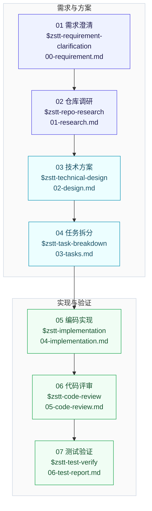
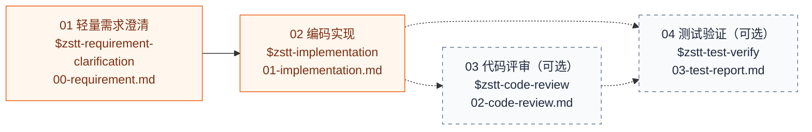

# ZSTT Backend Workflow

[](https://github.com/Foutlook/zstt-backend-workflow/actions/workflows/ci.yml)

面向小组的 Codex Java 后端开发工作流。它统一了需求澄清、代码调研、技术方案、任务拆分、编码实现、代码评审和测试验证，同时保留 quick/full 两种处理强度。

**快速导航：** [工作流总览](#工作流总览) · [安装](#安装) · [工作流使用](#工作流使用) · [阶段产物](#full-产物) · [辅助 Skill](#辅助-skill)

## 核心原则

- 用户显式调用具体阶段 Skill，工作流不会自动串行执行。
- 每次只完成当前阶段，并在业务仓库 `.zstt/` 生成一份唯一权威主产物。
- 当前阶段结束后只推荐下一步；用户可先修改产物，也可暂时停止。
- 用户调用下一阶段即表示同意推进，但上游产物必须重新校验且不存在 P0 阻塞。
- 首版仅支持 Codex 和 Java 后端项目。
- 流程止于测试验证完成，不自动 commit、push、合并或部署。

## 工作流总览

ZSTT 没有自动串行总入口。用户先选择处理模式，再显式调用当前阶段 Skill；图中的箭头表示推荐顺序，不表示系统会自动执行下一阶段。

| 模式 | 适用场景 | 固定主产物 | 阶段要求 |
| --- | --- | --- | --- |
| **Full** | 正式需求、跨模块改动、接口或数据结构变化、高风险业务逻辑 | 7 份 | 依次完成需求、调研、方案、任务、实现、评审和测试 |
| **Quick** | 范围明确、影响面小、风险较低且不需要独立方案评审的小改动 | 最多 4 份 | 需求澄清和实现必需；代码评审、测试验证按需调用 |

### Full 固定阶段



| 阶段 | 主要回答 | 唯一权威主产物 | 完成后 |
| --- | --- | --- | --- |
| 01 需求澄清 | 要做什么、边界和验收标准是什么，原始材料是否全部收口 | `00-requirement.md` | 推荐仓库调研 |
| 02 仓库调研 | 每个 Rxx 的真实入口、调用链、数据源、仓库范围及共享语义/SQL 影响是什么 | `01-research.md` | 推荐技术方案 |
| 03 技术方案 | 怎么改、为什么这样改、SQL 是否已确认、如何发布和回滚 | `02-design.md` | 推荐任务拆分 |
| 04 任务拆分 | 改哪些文件、按什么顺序、如何验证 | `03-tasks.md` | 推荐编码实现 |
| 05 编码实现 | 实际改了什么、是否偏离方案、验证结果如何 | `04-implementation.md` | 推荐代码评审 |
| 06 代码评审 | 实现是否正确、安全、可维护且与上游一致 | `05-code-review.md` | 推荐测试验证 |
| 07 测试验证 | 需求是否闭环、差异来自哪里、能否交付 | `06-test-report.md` | 固定流程结束 |

### Quick 轻量路径



`$zstt-bug-fix`、`$zstt-code-simplification` 和 `$zstt-module-refactor` 是可随时显式调用的辅助 Skill，不属于固定流程，也不推进阶段状态。

## Skill 与 Rules 分工

- Skill（技能）由用户显式选择，负责当前阶段或辅助任务的执行流程。
- Rules（规则）放在 `.zstt-kit/rules/`，由当前 Skill 在执行时动态读取，不作为用户可调用 Skill。
- Runtime（运行时）放在 `.zstt-kit/runtime/`，负责规则解析、阶段状态和确定性门禁。
- Templates（模板）放在 `.zstt-kit/templates/`，负责生成 `.zstt/` 阶段产物。

规则分为四类：`constraint`（强约束）、`decision`（条件决策）、`checklist`（检查表）和 `reference`（参考资料）。每个 Skill 先加载固定 profile（规则画像），再根据已经核实的真实代码范围追加上下文标签。例如，实现涉及 Jackson DTO 和批量查询时追加 `jackson`、`data-access`；只有出现真实变化轴或模式压力时才追加 `abstraction`、`design-patterns`。

上下文不能只凭文件名、类名或关键词推断。Skill 必须读取完整目标代码、真实调用链和最终数据源后再选择规则。解析结果包含规则集版本、规则 ID、选择原因和 SHA-256 指纹，工作范围扩大后必须重新解析。

## 高级能力

本项目不是把两套旧 Skill 改名后照搬，而是融合了 `agent-skills` 的证据化需求、方案、验收和代码简化能力，以及 `ggg-backend-skills` 的阶段门禁、跨仓库调研、任务编排、实现、评审和环境化测试能力。逐项来源和适配状态见 [高级能力融合矩阵](docs/advanced-capability-matrix.md)。

每个阶段都会先做能力探测，并记录三类结果：

- `增强路径`：远程仓库、CodeGraph、PDF/图像解析、运行环境或测试通道可用时，使用对应高级能力；
- `标准降级`：工具不可用时回退到本地源码、`rg`、静态证据或可执行的局部验证，并明确证据置信度和未验证边界；
- `阻塞`：缺少的环境、token、权限或前置数据会影响关键结论时，停止给出完成/通过结论。

工具不可用不等于可以省略能力目标，也不会成为伪造远程证据、运行结果或测试通过的理由。可选并行能力仅在用户明确要求或批准、且当前显式阶段证明安全时使用；主上下文负责去重、复核和最终写入。

仓库调研采用显式本地路径优先：用户给出仓库路径后，只读取指定 checkout，不检查或调用远程仓库 MCP；未给路径时，才检查本机受 Git 忽略的 `.zstt-kit/.env/.env.local` 私有配置，并确认当前会话确实暴露匹配的只读 MCP。配置缺失、工具未注册或调用失败时进入本地源码、CodeGraph、`rg` 和逐层阅读的默认降级。`.env.local` 不会自动注册 MCP，也不得把其中 URL 当普通 HTTP 接口请求。

每个阶段仍只有一个唯一权威主产物。接口明细、Schema、Review 轮次、测试轮次和代码简化记录等细节可写入 `auxiliary/`，但必须由主产物索引，不能形成第二份当前结论。系统可以推荐下一步，但不会自动执行任何推荐的 Skill。

技术方案采用阶段内 SQL Gate：先完成业务、职责、主流程和接口设计，再判断 SQL 影响。无 SQL 变化时记录依据后继续；新增或修改查询、DML、DDL、索引或约束时，先在 `auxiliary/sql-design.sql` 给出精确语句并等待用户确认，确认前不继续方案后半段，也不能进入任务拆分。确认后 SQL 变化会自动使旧指纹失效。

## 产物目录

full 正式需求写入：

```text
.zstt/features/YYYYMMDD-feature-name/
```

quick 小需求写入：

```text
.zstt/quick/YYYYMMDD-quick-name/
```

## 安装

ZSTT 使用与 Spec Kit 类似的项目初始化方式，不依赖 Codex 插件或 Marketplace。项目管理员安装 `zstt-cli`，把 Codex 项目级 Skills 写入业务仓库并随代码提交；普通成员拉取仓库后即可使用。

运行环境要求 Python 3.11+，推荐使用 `uv` 管理命令行工具。直接执行以下命令，默认从 GitHub `main` 分支安装最新版本：

```powershell
uv tool install zstt-cli --force --from "git+https://github.com/Foutlook/zstt-backend-workflow.git"
zstt version
```

私有仓库使用团队已有的 HTTPS 凭证或 SSH Key，不要把 token 写入命令或脚本。

### 项目管理员首次初始化

进入业务仓库执行：

```powershell
cd C:\projects\learning-service
zstt init --here
zstt doctor --here
```

初始化写入下列工具文件：

```text
.agents/skills/zstt-*/
.zstt-kit/rules/
.zstt-kit/runtime/
.zstt-kit/templates/
.zstt-kit/manifest.json
```

`.zstt-kit/manifest.json` 记录 CLI 版本和受管文件 SHA-256。CLI 不覆盖 `AGENTS.md`、其他项目级 Skill、业务源码或 `.zstt/features`、`.zstt/quick` 下的需求产物。初始化完成后新建 Codex 任务，让 Codex 加载 `$zstt-*` Skills。

`zstt doctor --here` 会同时检查安装清单、10 个项目级 Skill、Git 仓库根目录和 Codex 发现边界。出现 `Codex 可发现: 否` 时，应按诊断提示修复目录或重新初始化，再新建 Codex 任务。

> [!WARNING]
> `.agents/skills` 必须位于实际业务 Git 仓库内。若 `C:\idea_workspace_tob` 只是聚合目录，下面的 `jzx`、`backend-a` 等才是独立 Git 仓库，就要分别进入每个仓库执行 `zstt init --here`。Codex 从当前目录向上扫描到当前 Git 根目录，不会跨越子仓库边界读取聚合目录中的 Skills。

确认生成内容后，把 `.agents/skills/zstt-*` 和 `.zstt-kit/` 提交到业务仓库。普通团队成员只需拉取代码并新建 Codex 任务，不需要重复执行 `zstt init`；只有新项目初始化和工作流升级需要安装 `zstt-cli`。

### 项目工作流升级

先升级全局 CLI，再在每个业务仓库刷新受管文件：

```powershell
uv tool install zstt-cli --force --from "git+https://github.com/Foutlook/zstt-backend-workflow.git"
cd C:\projects\learning-service
zstt doctor --here
zstt check --here
zstt update --here
zstt doctor --here
```

如果受管 Skill、Rules、Runtime 或 Templates 被人工修改，`zstt update` 会在写文件前报告全部冲突并停止。人工合并后重试；只有明确接受覆盖时才使用 `zstt update --here --force`。`--force` 只作用于清单记录的 `.agents/skills/zstt-*`、`.zstt-kit/rules/`、`.zstt-kit/runtime/` 和 `.zstt-kit/templates/`，不能扩张到 `AGENTS.md`、`.zstt` 业务产物或其他 Skill。

从 0.1.x 升级时，清单 v1 会被兼容读取并升级为 v2。未修改的 `zstt-workflow-shared` 和 `zstt-java-backend-standard` 旧目录会被移除；存在本地修改时升级停止并报告冲突。

升级完成后新建 Codex 任务。

升级者应评审生成文件的 Git diff 并提交。其他成员拉取该提交后自动获得同一版本的项目级 Skills。CI 也可以安装清单记录的 CLI 版本后执行 `zstt check --here`，检测受管文件缺失、人工修改或版本未同步。

### 维护者本地开发

在本仓库安装当前工作区版本：

```powershell
uv tool install zstt-cli --force .
zstt version
```

再进入一个测试业务仓库执行 `zstt init --here` 或 `zstt update --here`。正式发布前运行：

```powershell
powershell.exe -NoProfile -ExecutionPolicy Bypass -File .\scripts\validate.ps1
```

验证脚本运行全部测试、编译 Python 源码、构建 Wheel，并检查 Wheel 包含完整 Skill、Rules、Runtime 和 Templates，且不包含 Codex 插件元数据。脚本不会自动 commit、push、合并或发布。

版本遵循语义化版本，发布变化记录在 [`CHANGELOG.md`](CHANGELOG.md)。README 中的安装命令默认继续安装 GitHub `main` 分支最新版本。

## 工作流使用

### 1. 进入业务仓库并新建 Codex 任务

项目管理员完成 `zstt init --here` 并提交生成文件后，团队成员只需拉取业务仓库，在仓库根目录新建 Codex 任务。不要在工作流项目目录中执行业务需求，也不需要普通成员重复初始化。

### 2. 显式发起需求澄清

Full 正式需求：

```text
$zstt-requirement-clarification
请按 full 模式澄清这份需求：<PRD、截图、流程图或口头说明>
```

Quick 小改动：

```text
$zstt-requirement-clarification
请按 quick 模式澄清这个小改动：<问题描述与验收标准>
```

用户未指定模式时，Skill 会根据范围、状态、权限、数据身份、旧链路副作用和关键契约给出 quick/full 推荐及依据；最终模式仍由用户选择，或由用户明确授权 AI 采用推荐。确认模式后，需求澄清会创建对应目录、`meta.json` 和 `00-requirement.md`。

需求材料中的独立要点使用 `Sxx`，正式需求使用 `Rxx`，疑问使用 `Qxx`。每个 `Sxx` 必须形成需求、形成疑问或明确不适用；每个 `Rxx` 必须有来源和验收覆盖。系统完成当前阶段后只推荐下一步，不会自动执行推荐的 Skill。`meta.json` v3 使用 `.zstt/...` 相对目录，避免把某个成员的本机绝对路径提交到仓库；读取旧 v2 状态后，会在下一次成功写入时自动迁移。

### 3. 审阅当前阶段产物

每个阶段结束时，Codex 应交付当前主产物路径、校验结论、开放问题和推荐 Skill。用户可以自由选择：

1. **继续**：显式调用推荐 Skill；
2. **修改**：直接编辑当前 `.zstt/` 主产物，再重新确认该阶段；
3. **暂停**：保留现有产物，之后从同一需求目录继续。

> [!IMPORTANT]
> `meta.json` 由 Runtime 维护，不要手工编辑。用户修改已完成主产物后，该阶段及其下游完成状态会失效；继续前必须重新校验修改后的权威内容，不能沿用旧结论。

### 4. 显式调用下一阶段

Full 示例：

```text
$zstt-repo-research
继续处理 .zstt/features/20260716-learning-report
```

后续阶段使用同一需求目录，并依次显式调用 `$zstt-technical-design`、`$zstt-task-breakdown`、`$zstt-implementation`、`$zstt-code-review` 和 `$zstt-test-verify`。

Quick 完成需求澄清后，直接显式调用实现阶段：

```text
$zstt-implementation
继续处理 .zstt/quick/20260716-fix-learning-report
```

Quick 的代码评审和测试验证由用户根据风险决定是否调用。实现完成后，状态会同时给出 `$zstt-code-review` 和 `$zstt-test-verify` 两个可选推荐；用户若直接完成测试，Quick 流程结束，不会再倒退推荐代码评审。即使跳过代码评审，测试报告仍固定使用 `03-test-report.md`。

### 5. 识别阶段是否真正完成

文档已经生成不等于阶段已经完成。只有内容门禁通过、P0 阻塞清零，并由 Runtime 成功记录产物指纹后，才可以继续下游。固定流程没有统一自动入口，也不会自动 commit、push、合并或部署。

## Full 产物

```text
.zstt/features/YYYYMMDD-feature-name/
├─ meta.json
├─ 00-requirement.md
├─ 01-research.md
├─ 02-design.md
├─ 03-tasks.md
├─ 04-implementation.md
├─ 05-code-review.md
├─ 06-test-report.md
└─ auxiliary/
```

每个阶段只生成自己的主产物，不提前创建后续空文档。

## Quick 产物

```text
.zstt/quick/YYYYMMDD-quick-name/
├─ meta.json
├─ 00-requirement.md
├─ 01-implementation.md
├─ 02-code-review.md
├─ 03-test-report.md
└─ auxiliary/
```

quick 必须先做轻量需求澄清。Review 和测试由用户决定是否调用；即使跳过 Review，测试报告仍固定使用 `03-test-report.md`。

## 状态和门禁工具

正常使用时由阶段 Skill 调用 Rules 和 Runtime。维护或排查时可以直接运行：

```text
python .zstt-kit/runtime/rule_resolver.py list-contexts
python .zstt-kit/runtime/rule_resolver.py resolve --skill zstt-implementation --context jackson --context data-access
python .zstt-kit/runtime/workflow_cli.py init --repo-root <repo> --mode full --feature-name <name>
python .zstt-kit/runtime/workflow_cli.py status --feature-dir <feature-dir>
python .zstt-kit/runtime/workflow_cli.py prepare-stage --feature-dir <feature-dir> --stage repo_research
python .zstt-kit/runtime/workflow_cli.py complete-stage --feature-dir <feature-dir> --stage requirement_clarification
```

- `prepare-stage` 在创建当前产物前重新校验上游，并对照内容指纹检测用户修改。
- `complete-stage` 除了校验状态、P0、章节和模板项，还会校验需求 `S/R/Q` 来源与验收覆盖、最终确认来源，以及调研 `R/C/E/RQ` 覆盖、仓库 ChangeScope、本地证据行号、共享语义和当前 SQL 事实，成功后记录新指纹。
- 已完成产物发生变化时，该阶段及其下游完成状态自动撤销，但原产物文件保留；用户重新执行被修改阶段的 `complete-stage` 后才能继续。
- `meta.json` 由工具维护，不要手工编辑。
- `recommended_next_skill` 保留首个推荐以兼容旧调用方；新调用方应优先读取 `recommended_next_skills`，以支持 Quick 的并列可选分支。

## 错误恢复

- Codex 找不到 `$zstt-*`：在当前业务 Git 仓库执行 `zstt doctor --here`；若提示 Skills 位于仓库边界外，则在当前仓库重新执行 `zstt init --here`，提交生成文件并新建 Codex 任务。
- 缺少上游文件：回到对应阶段 Skill 补齐，不手工创建后续文档。
- P0 阻塞：在上游权威产物完成确认并清零，再重新调用当前阶段。
- 用户修改已完成产物：系统撤销该阶段及下游完成状态；先核对修改影响，再重新完成被修改阶段。
- 内容门禁失败：按错误补齐 `Sxx/Rxx/Qxx/Cxx/Exx/RQxx/Dxx/Txx` 定义、引用、验收或影响矩阵后重试，不用只改 `status` 或数量字段绕过。
- 运行时证据不足：在调研、方案或测试产物中记录缺口和验证动作，不把静态推断写成事实。
- quick 影响面扩大：建议重新执行需求澄清并升级 full，不自动改变模式。

## 辅助 Skill

`$zstt-bug-fix` 用于 Java 后端 Bug、线上问题和偶现问题的证据化排查与最小修复。它先结合代码、Trace、日志、MySQL、ES 和时间线交付根因、影响与方案，只有用户看到结论后二次确认才修改代码。默认直接在当前任务中交付，不创建报告；只有用户明确要求保存文档时，独立记录才写入 `.zstt/bugs/`，关联需求时写入需求 `auxiliary/bugs/`。项目已注册只读 Observability MCP 时优先查询 Trace 和 SLS；未注册时输出精确降级查询条件。涉及新增能力、接口/消息契约、表结构、索引、SQL 口径、核心状态或权限变化时转入 Full/Quick 对应阶段，不借 Bug 修复绕过方案和 SQL Gate。

`zstt init/update` 会安装 `.zstt-kit/.env/.env.example`、`.env.prod.example` 和跨平台的 `runtime/with_env.py`。真实 `*.local` 配置始终由项目本机维护，不进入安装清单，安装和更新流程不会读取、覆盖或提交；生产配置缺失时禁止回退到测试环境。私有仓库 MCP 的真实服务名、传输类型、URL 和鉴权信息也只保存在本机 `.env.local`，不写入 Skill、代码、README、示例模板或阶段产物。ZSTT 不打包任何 MCP Server 二进制或凭据。

`$zstt-code-simplification` 可在任何时间对当前 diff、指定提交、文件或符号做行为保持型简化。它不属于固定流程，不修改阶段状态；关联需求时可在 `auxiliary/` 下记录结果。

`$zstt-module-refactor` 用于多文件职责拆分、模块化、DDD 边界和有证据的性能、并发、锁、内存/GC、资源生命周期治理。它不属于固定流程，不修改阶段状态；重大重构先生成 `.zstt/refactors/` 或需求 `auxiliary/refactors/` 下的计划并等待用户审批，可能改变业务行为的部分必须单独审批。

Java 开发规范、抽象、设计模式和 DDD 决策已经统一放入 `.zstt-kit/rules/java/`。它们由当前 Skill 动态读取，不再作为独立 Skill 暴露。

## 验证

```powershell
powershell.exe -NoProfile -ExecutionPolicy Bypass -File .\scripts\validate.ps1
```

验证脚本会运行仓库内 10 个 Skill 契约校验、全部测试、CLI 编译和 Wheel 内容校验。项目测试覆盖项目级 Skill/Rules/Runtime/Templates 安装、安全更新、v1→v2 升级、Git/Codex 发现诊断、规则动态选择与指纹、冲突保护、阶段顺序、meta v2→v3 迁移、路径安全、UTF-8 无 BOM、实质内容门禁、需求来源与验收覆盖、调研证据交叉引用、本地文件行号、共享语义/SQL 影响、内容指纹、上游失效、P0 阻断、Codex 元数据、quick 可选阶段和 full/quick 端到端流程。相同验证也会在 GitHub Actions 中对 `main`、版本标签和 Pull Request 自动执行。

## 非目标

- 不自动串行执行阶段。
- 不在缺少用户选择或明确授权时自动选择 quick/full；允许先给出推荐和依据。
- 首版不支持非 Java 技术栈或自动多 Agent 编码。
- 不自动 commit、push、合并、发布或部署。
